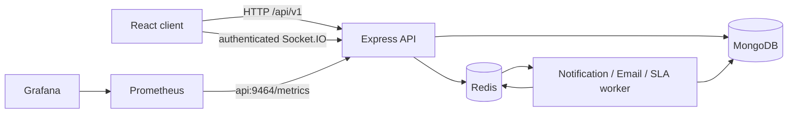

# Enterprise IT Service Management Platform

A full-stack, multi-tenant IT Service Management and Incident Response platform for organizations to manage incidents, service requests, assets, SLAs, changes, knowledge, problems, RCA, analytics, notifications, and audit activity.

This repository contains the current MERN-014 ITSM implementation: a React client, an Express/TypeScript API, MongoDB persistence, Redis-backed workers, and Dockerized local infrastructure.

## Business Problem and Solution

IT operations often spread incidents, requests, asset records, approvals, knowledge, and follow-up actions across disconnected tools. This platform provides one tenant-scoped workflow for reporting and resolving incidents, requesting services, managing assets and changes, tracking SLAs, documenting knowledge and root causes, and observing operational activity.

## Core Capabilities

- Organization, department, support-team, invitation, and user administration
- ADMIN and EMPLOYEE authentication and role-based access
- Tenant-scoped incidents with priority, severity, assignment rules, escalation, resolution, and PDF export
- Service catalog and service-request workflows
- Asset inventory, assignment, warranty, maintenance, and lifecycle history
- SLA deadlines, business hours, breach detection, and escalation policies
- Problem management and root-cause analysis with corrective actions and related incidents
- Change management with risk, scheduling, approval, rollback, and execution state
- Knowledge-base articles, typed categories, tenant-scoped search, and attachment metadata
- Tenant analytics for incidents, SLAs, resolution time, administrators, assets, and changes
- Idempotent notifications, realtime Socket.IO delivery, and mutation audit logs

## Technology Stack

**Frontend:** React 18, TypeScript, Vite, Tailwind CSS, shadcn/Radix UI, React Router, Redux Toolkit, TanStack Query, Axios, React Hook Form, Zod, Recharts, and Socket.IO client.

**Backend:** Node.js 22, Express 5, TypeScript, MongoDB, Mongoose, JWT, bcrypt, Redis, BullMQ, Socket.IO, Nodemailer, PDFKit, Jest, and Supertest.

**Infrastructure:** Docker, Docker Compose, Prometheus, Grafana, MongoDB 7, and Redis 7 Alpine.

## High-Level Architecture



The backend follows route, controller, service, repository/model boundaries where implemented. Authentication and tenant context are applied before protected business operations. Background jobs are separated from the API process.

## Platform Preview

Screenshots are intentionally not fabricated. Add captures from the real running application under `docs/assets/screenshots/` when the submission walkthrough is recorded.

## Key ITSM Modules

| Module | Current responsibility |
| --- | --- |
| Identity and administration | Organizations, departments, support teams, invitations, users, and roles |
| Incident management | Incident lifecycle, assignment, escalation, resolution, and export |
| Service operations | Catalog offerings and service requests |
| Asset management | Inventory, assignment, maintenance, warranty, and lifecycle history |
| SLA management | Response/resolution targets, business hours, breach scans, and escalations |
| Problem and RCA | Problem records, root cause, related incidents, lessons, preventive and corrective actions |
| Change management | Risk, schedule, approval/rejection, rollback, and execution workflow |
| Knowledge base | Articles, FAQs, troubleshooting guides, SOPs, search, and attachment metadata |
| Analytics and notifications | Tenant analytics, notification feeds, realtime events, and audit logs |

## Workflow Overview

- **Incident:** report → classify by priority/severity → evaluate active assignment rules → notify → resolve/close.
- **Service request:** submit a catalog-backed request → requester-safe updates or cancellation → administrator assignment and progression.
- **Change:** create → assess risk and schedule → administrator approval/rejection → execute or roll back.
- **SLA:** create from incident priority → calculate deadlines using validated business hours → record response/resolution → scan breaches and apply matching escalation policies.
- **RCA:** connect a root-cause record to a problem and related incidents → document corrective, preventive, and lessons-learned information.

## Multi-Tenant Architecture

Authenticated JWT claims provide `organizationId`. Tenant-owned reads, writes, deletes, relationship checks, notifications, assignments, and audit reads are scoped to that organization. Client-supplied organization identifiers are not trusted for protected operations.

## ADMIN / EMPLOYEE RBAC

The current implementation has two application roles:

- **ADMIN:** manages tenant administration, users, departments, support teams, operational assignment, approvals, audit reads, and other administrator-protected workflows.
- **EMPLOYEE:** acts as an authenticated requester and can use the employee-permitted read and request workflows. Employees are not operational assignees.

Frontend guards improve usability only. Backend authorization and tenant validation remain the security boundary.

## Security

- JWT bearer authentication with organization and role claims
- Public registration always creates an employee
- Token-gated first-tenant administrator bootstrap
- ADMIN-only protected mutations and audit reads
- Same-tenant validation for relationship targets and notification recipients
- Bcrypt password hashing
- Redaction of passwords, tokens, secrets, cookies, authorization values, and API keys from audit metadata
- Configurable client origin for API and Socket.IO CORS

## Swagger / OpenAPI

Swagger UI is served by the backend at [`http://localhost:5000/api-docs`](http://localhost:5000/api-docs). The generated OpenAPI document is available at [`http://localhost:5000/api-docs/openapi.json`](http://localhost:5000/api-docs/openapi.json).

See [API_DOCUMENTATION.md](docs/API_DOCUMENTATION.md) for the access model and route groups.

## Prometheus and Grafana

The API exposes metrics on the separate listener at `http://localhost:9464/metrics`. Prometheus scrapes `api:9464` using [monitoring/prometheus/prometheus.yml](monitoring/prometheus/prometheus.yml), and Grafana is provisioned from [monitoring/grafana/](monitoring/grafana/).

## Dockerized Infrastructure

Docker Compose runs MongoDB, Redis, the API, the worker, Prometheus, and Grafana. MongoDB and Redis healthchecks gate API and worker startup. Prometheus waits for API health, and Grafana waits for Prometheus health.

## Quick Start

### Frontend

```powershell
Set-Location client
npm ci
npm run dev
```

### Backend

Configure the root `.env` from [.env.example](.env.example), then:

```powershell
Set-Location server
npm ci
npm run dev
```

Start the worker separately when MongoDB and Redis are available:

```powershell
Set-Location server
npm run worker
```

### Docker Compose

Provide required secrets privately, then run from the repository root:

```powershell
$env:JWT_SECRET = "<strong-random-secret>"
$env:BOOTSTRAP_TOKEN = "<one-time-bootstrap-token>"
$env:GRAFANA_ADMIN_PASSWORD = "<private-grafana-password>"
docker compose config
docker compose up --build -d
```

Safe stop without deleting persistent data:

```powershell
docker compose down
```

Do not use `docker compose down -v` unless intentionally resetting local databases and volumes.

## Environment Configuration

Backend variables include `MONGO_URI`, `REDIS_URL`, `JWT_SECRET`, `BOOTSTRAP_TOKEN`, `CLIENT_URL`, `PORT`, metrics settings, and optional SMTP settings. Frontend variables are Vite build-time values: `VITE_API_BASE_URL`, `VITE_APP_NAME`, and `VITE_APP_VERSION`.

See [DEPLOYMENT_GUIDE.md](docs/DEPLOYMENT_GUIDE.md) for the complete placeholder configuration and startup procedures. Real secrets are intentionally excluded from documentation.

## Application and Service URLs

| Service | URL |
| --- | --- |
| React client | `http://localhost:5173` |
| API health | `http://localhost:5000/api/v1/health` |
| Swagger UI | `http://localhost:5000/api-docs` |
| OpenAPI JSON | `http://localhost:5000/api-docs/openapi.json` |
| Prometheus | `http://localhost:9090` |
| Grafana | `http://localhost:3000` |
| API metrics | `http://localhost:9464/metrics` |

## Repository Structure

```text
itsm-platform/
├── client/                 # React frontend
├── server/                 # Express/TypeScript backend, workers, and tests
├── docs/                   # Final submission documentation and assets
├── ai-context/             # Internal planning and development context
├── monitoring/             # Prometheus and Grafana configuration
├── Dockerfile
├── docker-compose.yml
├── .env.example
└── README.md
```

## Testing and Quality Assurance

Current verification evidence includes:

- Backend Jest: **37 suites, 669 tests passed**
- Backend TypeScript typecheck: passed
- OpenAPI route inventory: **129 operations**
- Frontend TypeScript typecheck: passed
- Frontend production build: passed
- Docker Compose configuration: passed
- `git diff --check`: passed with the repository's existing line-ending warning only

The frontend build retains the existing bundle-size warning. Docker runtime verification must be repeated when the Docker Desktop Linux engine is available.

## Scalability and Reliability

The current design separates API and worker processes, uses tenant-oriented indexes, asynchronous BullMQ jobs, Redis-backed realtime delivery, persistent Compose volumes, and health-gated service startup. It does not claim production-scale certification. Load testing, durable outbox transactions, pagination at scale, and horizontally scaled Socket.IO deployment remain operational follow-up areas.

## Documentation

- [Architecture](docs/ARCHITECTURE.md)
- [Database design](docs/DATABASE_DESIGN.md)
- [API documentation](docs/API_DOCUMENTATION.md)
- [Deployment guide](docs/DEPLOYMENT_GUIDE.md)
- [Internal development context](ai-context/)
- [Frontend-specific setup](client/README.md)

## Project / Submission Status

The current ITSM implementation is feature-complete for the implemented case-study scope and has a verified backend/frontend build checkpoint. The repository is organized for internship submission. Final real-application screenshots and a connected Docker runtime recheck remain presentation and environment follow-up work; no production certification is claimed.
