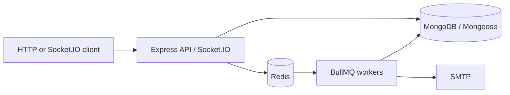

# System Overview

This is an API-first Node.js/Express and TypeScript backend. MongoDB with Mongoose is the primary data store. Redis supports BullMQ queues and notification pub/sub. The HTTP API and Socket.IO run in the server process; notification and email workers run from the separate worker entry point.



# Backend Request Flow

The normal request path is:

```text
Route -> Controller -> Service -> Repository -> MongoDB
```

`src/app.ts` mounts the module routers below `/api/v1`. Controllers translate HTTP input and responses, services apply business rules, repositories perform tenant-scoped persistence, and Mongoose models define the MongoDB documents.

The repository boundary is not consistent everywhere. Service-request services use Mongoose directly, and parts of RCA and SLA logic also access models without a repository. Some cross-module services read another module's model/repository directly when validating relationships.

# Authentication & Authorization

- Registration and login are public auth routes. Public registration currently persists every new user as `employee`, regardless of a client-supplied role. A separate bootstrap route can create the first organization administrator only with `BOOTSTRAP_TOKEN` and only while no users exist.
- Login signs a JWT containing `id`, `email`, `role`, and `organizationId`.
- `authenticate` reads a `Bearer` token, verifies it with `JWT_SECRET`, and places those claims on `req.user`.
- `authorize(...roles)` checks the JWT role and returns `403` when it is not allowed.
- `requireOrganization` verifies that an authenticated request has an organization claim.
- Role protection is applied unevenly. Change approval/rejection and RCA/corrective-action mutations now require the admin role; other authorization gaps remain under audit.

# Multi-Tenant Flow

`organizationId` is the tenant context carried in JWT claims and attached to organization-owned records. Services pass it into repositories, which normally include it in reads, updates, deletes, and relationship checks.

```text
JWT.organizationId
        |
        v
authenticated request -> controller -> service -> repository filter
                                                   |
                                                   v
                                             tenant-scoped MongoDB data
```

Tenant isolation is substantial but not universal. Escalation policy targets and support-team members are validated against the authenticated organization and active-user rules; pagination and scale/security proof remain incomplete.

# Incident Automation Flow

Incident creation validates the reporter and organization, determines priority and severity, and asks the ordered active assignment rules to find a matching target. When a user is assigned, an assignment notification is queued.

```text
Incident creation
  -> assignment rule matching
  -> assigned user
  -> BullMQ notification queue
```

Incident creation also queues a deterministic new-incident event for active tenant administrators. Assignment notifications remain on the existing path. Change approvals and service-request workflow updates use the shared event enqueue helper with tenant-safe recipients and deterministic job/notification IDs.

# Background Processing

BullMQ uses Redis as its queue backend. `src/worker.ts` connects to MongoDB and Redis, then starts:

- The notification worker, which validates job data and active tenant recipients, suppresses duplicate deterministic notification IDs, persists a notification in MongoDB, and publishes a realtime event through Redis.
- The email worker, which consumes email jobs and sends them through the configured SMTP service.

The queues use test doubles when `NODE_ENV` is `test`; production/development queues use BullMQ with the shared Redis connection.

# Real-Time Notification Flow

```text
Backend event/job
  -> notification persisted in MongoDB
  -> Redis channel: notification:realtime
  -> API Redis subscriber
  -> Socket.IO event: notification:new
  -> user:<id> room (and organization room membership)
```

The server initializes Socket.IO and a dedicated Redis subscriber. Socket connections authenticate with a JWT and automatically join both `user:<id>` and `organization:<organizationId>` rooms. The current notification subscriber emits the received event to the recipient's user room.

# SLA Flow

The SLA service currently:

1. Loads an incident through a tenant-scoped repository.
2. Applies an in-code priority rule for response and resolution minutes.
3. Calculates deadlines using default business hours.
4. Persists the SLA through the SLA repository.
5. Supports manual response/resolution recording and a breach check that updates breach flags and status.

`src/jobs/queues/sla.queue.ts` registers a repeatable BullMQ scan job, and `src/workers/sla.worker.ts` invokes the scan in the separate worker process. The scan excludes resolved/closed incidents, persists breach flags, claims each breach notification once, selects active same-tenant escalation policies by priority and elapsed threshold, claims each policy once, and queues notifications to valid user/team recipients.

# Data Layer

MongoDB is accessed through Mongoose models and repositories. Repositories are commonly responsible for queries constrained by `organizationId`, including incident, SLA, notification, change, asset, and related domain records. Mongoose supplies schemas, validation, references, and indexes.

The repository pattern is the intended structure, but it is not universal: service requests and portions of RCA/SLA use direct model access, and cross-module model access is present. MongoDB is external to the application deployment described by the current compose file.

# Main Modules

- **Auth/users and organizations:** registration, login, current-user access, user administration, organization records, and tenant identity.
- **Departments and support teams:** organizational grouping and support membership records.
- **Incidents:** incident lifecycle, assignment, resolution, and PDF export.
- **Incident assignment and escalation:** ordered assignment rules and escalation policy configuration.
- **SLA:** response/resolution deadlines, business-hours calculation, manual breach and completion tracking.
- **Problems and RCA:** problem workflow, root-cause records, related incidents, lessons, preventive actions, and corrective actions.
- **Changes:** change requests, risk, schedules, affected assets, and approval status.
- **Assets:** asset records and assignment/unassignment.
- **Service catalog and service requests:** catalog entries and request workflow for supported request types.
- **Knowledge base:** tenant-scoped articles and publication state.
- **Analytics:** incident trends, SLA compliance, resolution time, technician performance, asset health, and change success-rate endpoints.
- **Notifications:** notification records, tenant-safe idempotent notification jobs for incident creation/assignment, SLA breach/escalation, change approval, and service-request updates, plus realtime delivery.
- **Audit:** tenant-scoped audit records for API mutations, with actor identity, action/event, resource identity, outcome, timestamp, redacted metadata, and admin-only organization-scoped reads.

The organization/tenant identity connects these modules. Incidents connect to assignment rules, users, notifications, and optional SLA records; problems connect to RCAs and related incidents; changes can reference assets.

# Infrastructure Status

- **MongoDB:** Mongoose connection with `MONGO_URI`; system of record. Not defined in the current compose file.
- **Redis:** ioredis connection from `REDIS_URL` or localhost; BullMQ backend and realtime pub/sub. Compose defines Redis 7 with append-only persistence.
- **Docker:** Compose defines API and worker services from the multi-stage `Dockerfile`, plus MongoDB and Redis with persistent volumes, healthchecks, internal service URLs, and health-gated startup. The local runtime was verified with healthy services, API health, worker startup, and a processed BullMQ notification job.
- **Workers:** separate `src/worker.ts` process starts notification and email BullMQ workers.
- **Socket.IO:** initialized by `src/server.ts` on the HTTP server; JWT-authenticated connections join user and organization rooms.
- **Email:** email queue and worker call the configured Nodemailer/SMTP service. Delivery configuration and runtime verification are external.
- **PDF export:** incident PDF generation and streaming are implemented in the incident module.

# Known Architecture Gaps

Current gaps from `docs/api/PROJECT-AUDIT.md` include:

- No React frontend. Production deployment still requires environment-specific TLS, secret management, backups, resource limits, monitoring, and orchestration decisions documented in the deployment guide's checklist.
- Notification delivery has no durable outbox transaction across domain writes and queue writes; runtime Redis/worker delivery verification remains incomplete.
- Escalation target validation is implemented and covered by the passing integration suite for active same-tenant users and same-tenant support teams.
- Authorization is still uneven outside the fixed P0 paths; remaining audited role and ownership concerns require separate work.
- Asset warranty, maintenance history, and auditable lifecycle history are implemented.
- Knowledge-base search, secure attachments, and formal article types are implemented.
- Audit logging is centralized in `src/middleware/audit.middleware.ts` and `src/modules/audit/`; request logging remains diagnostic only and is not treated as the audit trail.
- Pagination, load/capacity evidence, queue operations, Socket.IO scaling, and runtime integration tests are incomplete.
- Support-team membership validation accepts only active same-tenant employees and its model references the application `AuthUser` model.
- Socket.IO falls back to unrestricted CORS when `CLIENT_URL` is not configured.
