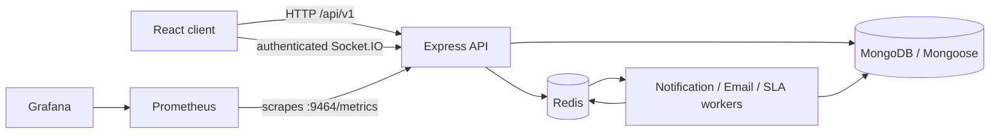

# ITSM Platform Architecture

## Overview

The ITSM Platform is a full-stack, multi-tenant incident and service-management application. The React client in `client/` consumes the versioned Express API in `server/`. MongoDB stores application data, Redis supports queues and realtime notification delivery, and a separate worker process handles notification, email, and scheduled SLA jobs.



## Repository Boundaries

- `client/`: React, TypeScript, Vite, Tailwind, shadcn/Radix UI, Redux Toolkit, TanStack Query, and page/domain services.
- `server/`: Express/TypeScript API, Mongoose models, repositories, services, workers, Jest tests, and generated OpenAPI metadata.
- `docs/`: submission-facing technical documentation.
- `ai-context/`: internal planning and development history.
- `monitoring/`: Prometheus and Grafana provisioning.
- Root `Dockerfile` and `docker-compose.yml`: container build and local infrastructure topology.

## Backend Request Flow

```text
HTTP request
  -> Express middleware
  -> authentication / authorization
  -> route
  -> controller
  -> service and validation
  -> repository or model access
  -> MongoDB
```

The repository pattern is used broadly for tenant-scoped persistence. Some service-request, RCA, and SLA paths use direct Mongoose access where implemented. This document describes the current implementation rather than an idealized architecture.

## Authentication, RBAC, and Trust Boundaries

- JWT login claims contain user identity, role, and `organizationId`.
- The only application roles are `ADMIN` and `EMPLOYEE`.
- Public registration creates employees; the one-time bootstrap operation creates the first tenant administrator when its token and empty-user preconditions pass.
- Backend `authenticate` validates bearer tokens. `authorize("admin")` protects administrator operations.
- The client may hide controls for usability, but backend authorization is authoritative.
- Employees are requesters and are not valid operational assignees. Assignment and workflow rules are enforced by backend validation.
- Secrets remain in environment configuration and are not part of API responses or documentation.

## Multi-Tenant Boundaries

The authenticated JWT supplies the tenant context. Tenant-owned reads, writes, deletes, relationship checks, notification recipients, audit reads, and assignment targets are scoped to the authenticated organization. Cross-tenant identifiers supplied by clients are not trusted as tenant selectors.

## Domain Boundaries

The backend currently contains modules for:

- Authentication, users, invitations, organizations, departments, and support teams
- Incidents, assignment rules, escalation policies, and SLAs
- Service catalog and service requests
- Assets, maintenance history, and lifecycle history
- Problems, RCA, corrective actions, related incidents, lessons, and preventive actions
- Changes and approval workflow
- Knowledge base articles, categories, search, and attachment metadata
- Analytics, notifications, audit logs, and diagnostic job routes

## Background Processing and Realtime Delivery

BullMQ uses Redis as its queue backend. The worker starts notification, email, and scheduled SLA workers. Notification jobs are tenant-safe and idempotent where deterministic event identifiers are used. Persisted notifications are published through Redis and delivered to authenticated Socket.IO user rooms by the API subscriber.

## API Documentation and Observability

Swagger UI is served at `/api-docs`, with the generated OpenAPI JSON at `/api-docs/openapi.json`. The API exposes health at `/api/v1/health` and metrics on the separate metrics listener at `/metrics` on port `9464` by default. Prometheus scrapes `api:9464`; Grafana is provisioned from the root `monitoring/` directory.

## Docker Topology

Compose defines MongoDB, Redis, an API container, a worker container, Prometheus, and Grafana. API and worker use the same multi-stage image. MongoDB and Redis healthchecks gate API and worker startup; Prometheus waits for API health, and Grafana waits for Prometheus health.

## Scalability and Reliability

The current design supports horizontal separation of API and worker responsibilities, tenant-oriented indexes, asynchronous queue processing, Redis-backed realtime delivery, persistent local data volumes, and health-gated startup. It does not claim production-scale certification. Pagination, load testing, durable outbox transactions, and horizontally scaled Socket.IO deployment remain operational follow-up areas.
