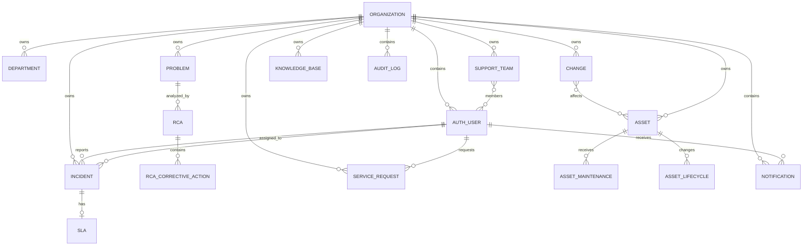

# ITSM Platform Database Design

## Storage Model

The backend uses MongoDB with Mongoose. Tenant-owned documents carry `organizationId` or are reached through a tenant-owned relationship. Protected repository and service operations use the authenticated organization context when querying, mutating, or validating relationships.

## Entities

| Entity | Purpose | Key relationships |
| --- | --- | --- |
| `Organization` | Tenant identity and status. | Parent tenant for users and tenant-owned records. |
| `AuthUser` | Identity, credentials, role, active state, and tenant. | Reporter, requester, assignee, approver, actor, creator, and recipient references. |
| `Invitation` | Token-based tenant onboarding. | Organization and invited email. |
| `Department` | Organization department. | Belongs to an organization. |
| `SupportTeam` | Tenant support group. | Organization and active same-tenant members. |
| `Incident` | Incident lifecycle, priority, severity, assignment, and resolution. | Reporter, optional assignee, organization, and optional SLA. |
| `IncidentAssignmentRule` | Ordered automatic incident assignment. | Organization and target user. |
| `IncidentEscalationPolicy` | SLA escalation configuration. | Organization, optional target user, and optional support team. |
| `SLA` | Response/resolution deadlines and breach state. | Organization and incident. |
| `Problem` | Underlying issue and problem workflow. | Organization and related RCA records. |
| `RCA` | Root-cause analysis record. | Problem, related incidents, author, and organization. |
| `RCACorrectiveAction` | Corrective-action workflow. | RCA, assignee, creator, and organization. |
| `ServiceCatalog` | Organization service offering. | Organization and catalog requests. |
| `ServiceRequest` | Requester service workflow. | Requester, optional assignee, approver, and organization. |
| `Change` | Change request, risk, schedule, approval, and execution state. | Requester, assignee, approver/rejector, affected assets, and organization. |
| `Asset` | IT asset inventory and lifecycle state. | Organization, optional assignee, changes, maintenance, and lifecycle records. |
| `AssetMaintenance` | Append-only maintenance event. | Asset, creator, and organization. |
| `AssetLifecycle` | Asset status transition event. | Asset, optional actor, and organization. |
| `KnowledgeBase` | Tenant article, publication, category, and embedded attachment metadata. | Creator and organization. File bytes are not stored by this model. |
| `Notification` | Recipient notification and read state. | Recipient, optional related entity, and organization. |
| `AuditLog` | Redacted mutation/audit record. | Optional actor/resource identity and organization. |

## Relationship Summary

## Indexing

The current schemas define indexes for common tenant and workflow queries. Verified examples include:

- Organization plus timestamp/resource indexes for `AuditLog`.
- Organization, status, priority, assignment, and timestamp combinations for operational records such as incidents, changes, service requests, SLAs, and notifications.
- Organization-scoped lookup indexes for departments, support teams, assignment rules, escalation policies, knowledge-base records, RCA records, assets, and lifecycle/maintenance history.
- Token/status/expiry lookup for invitations.

Compound unique indexes are used where the model defines organization-scoped business identifiers, including operational IDs and selected tenant names. The source schemas remain authoritative for exact field ordering and uniqueness.

## Data Protection and Lifecycle Rules

- Passwords are bcrypt-hashed and are not returned by user read/list contracts.
- Audit metadata redacts passwords, tokens, secrets, cookies, authorization values, and API keys.
- Asset maintenance and lifecycle records are append-only through their supported APIs.
- Knowledge-base attachments store metadata only; the current API does not provide arbitrary binary upload/download storage.
- Tenant isolation is an application access rule enforced by JWT organization context and backend queries. Production MongoDB access control, encryption, backup, and retention are deployment responsibilities.
