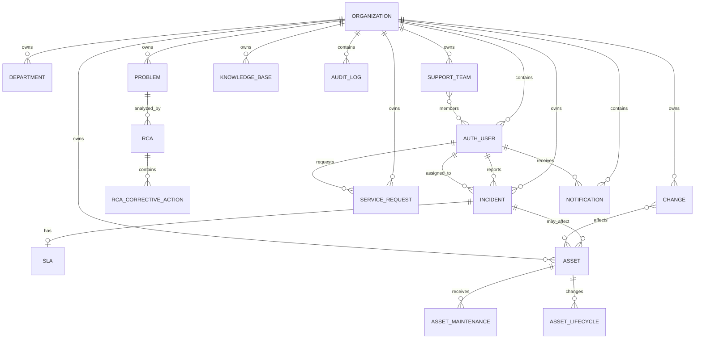

# MERN-014 Database Design

The backend uses MongoDB with Mongoose. Every tenant-owned document carries `organizationId`, and protected repositories include that value in their query filters.

## Core Models

| Model | Purpose | Main relationships |
| --- | --- | --- |
| `Organization` | Tenant identity and active status. | Parent tenant for users and organization-owned records. |
| `AuthUser` | User identity, role, active status, and tenant. | Belongs to one `Organization`; referenced by reporters, assignees, approvers, actors, and creators. |
| `Department` | Tenant department. | Belongs to one `Organization`. |
| `SupportTeam` | Tenant support group. | Belongs to one `Organization`; `members` reference active same-tenant `AuthUser` employees. |
| `Incident` | Incident lifecycle and resolution. | Belongs to `Organization`; references reporter and optional assignee; may have one SLA. |
| `IncidentAssignmentRule` | Ordered automatic assignment rule. | Belongs to `Organization`; references a same-tenant target user. |
| `IncidentEscalationPolicy` | SLA escalation rule. | Belongs to `Organization`; references a same-tenant target user or support team. |
| `SLA` | Response/resolution targets and breach state. | Belongs to `Organization`; references one `Incident`. |
| `Problem` | Underlying issue and problem workflow. | Belongs to `Organization`; can be related to RCA records. |
| `RCA` | Root cause analysis. | Belongs to `Organization`; references a `Problem`, related incidents, and identifying user. |
| `RCACorrectiveAction` | Action workflow attached to an RCA. | Belongs to `Organization`; references RCA, assignee, and creator. |
| `ServiceCatalog` | Catalog item definition. | Belongs to `Organization` where configured by the module. |
| `ServiceRequest` | User request and approval/workflow state. | Belongs to `Organization`; references requester, optional assignee, and approver. |
| `Change` | Change request, risk, schedule, approval, and execution. | Belongs to `Organization`; references requester, assignee, approver/rejector, and affected assets. |
| `Asset` | IT asset and lifecycle state. | Belongs to `Organization`; optional assignee; referenced by changes and maintenance/lifecycle records. |
| `AssetMaintenance` | Append-only maintenance event. | Belongs to `Organization`; references an `Asset` and creator. |
| `AssetLifecycle` | Asset status transition audit event. | Belongs to `Organization`; references an `Asset` and optional actor. |
| `KnowledgeBase` | Tenant article and publication state. | Belongs to `Organization`; references creator and embedded attachment metadata. |
| `Notification` | User notification and read state. | Belongs to `Organization`; references recipient and optional related entity. |
| `AuditLog` | Security/business mutation record. | Belongs to `Organization`; optional actor and resource identity; metadata is redacted before storage. |

## Relationship Overview

## Tenant and Indexing Rules

- Organization-owned collections store an `organizationId` reference.
- Repository methods normally filter by both resource identity and `organizationId` for reads, updates, and deletes.
- Unique business identifiers such as incident IDs, asset IDs, change IDs, request IDs, and team names are scoped to the organization where the model defines the compound unique index.
- Common indexes cover organization plus status, priority, assignment, timestamps, recipient, or resource identity.
- `AuditLog` indexes organization/timestamp and organization/resource identity for tenant-safe retrieval and investigation.

## Lifecycle and Embedded Data

- Asset lifecycle transitions are stored as immutable `AssetLifecycle` records.
- Asset maintenance entries are append-only `AssetMaintenance` records.
- Knowledge-base attachments are embedded metadata records containing filename, MIME type, size, storage key, uploader, and upload timestamp. The application does not store file bytes.
- Notification related entities store an entity type and ObjectId reference; realtime payloads are published through Redis.

## Data Protection

- Passwords are hashed with bcrypt in the auth service and are not returned by user list/read responses.
- JWT secrets, passwords, tokens, cookies, authorization values, and API keys are excluded from audit metadata.
- Tenant filters are part of the application access contract; MongoDB network protection, backups, encryption, and production credentials belong to the deployment environment.
